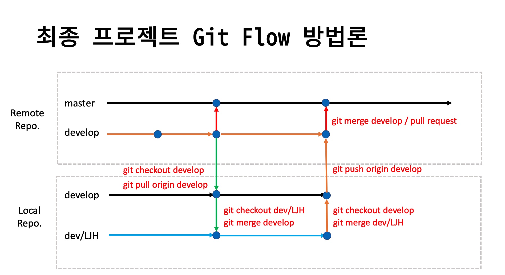

# KD9_Project
K-Digital 9기 프로젝트

### ML-Agents 수업 프로젝트
- [MLMummy 프로젝트](https://github.com/IndieGameMaker/KD9_Mummy)
- [MLSoccer 프로젝트](https://github.com/IndieGameMaker/KD9_MLSoccer)

### ML-Agents를 활용한 개인 프로젝트

#### 프로젝트 장르
1. 무한 러닝 게임
2. 레이싱(자율주행)
3. 개인 자유 주제
4. 수업 프로젝트 응용

#### 프로젝트 제작기간
- 2022/5/10 ~ 2022/5/17
- 2022/5/17 프로젝트 결과내용은 메디치 카페 [K_VR/AR_프로젝트] 게시판에 업로드
- 결과 동영상 및 간단한 개요 작성

## 최종 프로젝트 - VR/AR 콘텐츠 개발 프로젝트

### 프로젝트 일정

| 일정             | 기간          |
| :--------------- | :------------ |
| **개발 기간**    | 05/31 ~ 07/15 |
| **중간 점검**    | 06/23      |
| **발표 문서작성** | 07/04 ~    |
| **발표 리허설**   | 07/14 (10:00 ~) |
| **시연 및 발표** | 07/14 (12:30부터 시연, 2:30 부터 발표) |

- 프로젝트의 목적
  - 교육기간동안 습득한 VR,AR 기술을 종합적으로 사용한 최종 프로젝트로서 전반적인 개발 과정을 이해하고 다양한 시행착오를 통해 개개인의 개발 역량을 강화한다.
  - 협업을 통해 각각의 역할을 이해하고 개발자간의 연계 작업에 대한 능력을 향상 시킨다.

- 구현 주제

  - 콘텐츠의 내용 및 주제는 제한이 없으며 VR,AR 관련된 콘텐츠를 개발한다.
  - 구현 형태는 체험 또는 게임의 형태이여도 관계없음.
  - 개발할 콘텐츠의 주제 선정시 대상 연령층을 명확히 한다. (예: 성인, 청소년, 아동, ...)
  - 구현 디바이스(Vive, Quest)의 한계를 명확히 인지하고 콘텐츠의 리소스 및 전체적인 분위기(테마)를 선정한다.

- 팀 구성 및 팀장의 역할
  - 기본 3인 1팀으로 구성한다. (특별한 경우 4인 1팀까지도 허용)
  - 팀장은 반드시 팀원들의 동의를 거쳐 선정한다.
  - 팀장과 팀원은 수직적인 관계가 아니며 수평적인 관계임을 명심한다.
  - 팀장은 프로젝트의 전체 일정과 팀원의 업무 분담등 전체적인 프로젝트 관리의 책임을 진다.
  - 팀장은 수시로 프로젝트의 진행상황에 대해 지도강사와 소통한다.
  - 팀장은 팀원의 작업물에 대한 정기적인 통합(Merge)와 프로젝트 전체 백업을 진행한다.(최소 주 1회 이상)
  - 하원시 커밋 & 푸시, 등원시 풀(pull)한 후 작업 진행을 원칙
  - 팀원은 로컬HDD에 개별 백업을 매일 진행한다.(선택사항)

- 협업 및 형상관리
  - 일정관리는 **Trello** 또는 **Notion**을 활용하며 모니터링을 위해 지도 강사(myleje@gmail.com)를 반드시 초대한다. [(트렐로 trello.com)](https://trello.com) 
  - 협업 메신저을 사용할 경우 슬렉([Slack](https://slack.com/intl/en-kr/))로 팀 내부적으로 사용하는 것도 권장.
  - 형상관리는 깃허브(Github)를 사용한다. (Unity 콜라보레이트도 괜찮으나 깃과 깃허브를 권장)
  - GitHub GUI 툴은 **[SourceTree](https://www.sourcetreeapp.com)**, [GitHub Desktop](https://desktop.github.com),   [GitKraken](https://www.gitkraken.com) 중 하나를 선택한다. (SourceTree 권장함.)
  - SourceTree는 팀원간의 깃 사용이 능숙해지는 중간 평가후 사용한다.(선택사항) 그전까지는 CLI(Command Line Interface)에서 명령어를 통해 작업한다.
  - 깃허브 사용시 개발자별 브랜치를 생성한다. 개발자 브랜치의 네이밍을 다음과 같이 **dev/영문이니셜** 방식을 추천.
    ```
    dev/LJH
    dev/PJW
    ```
  - 개발 브랜치(develop)를 운영할 것인지를 결정
  - 깃허브 사용시 다양한 충돌(conflict)를 경험하게될 것이며 이를 방지하거나 해결하는 경험을 쌓는다.
  - 팀장은 매일 팀원들의 소스 코드의 수동 백업 여부를 확인 및 관리한다.

- 구현 기기
  - HMD 장비 : Vive, Oculus Quest (택일)
  - 어트렉션  : Sym4D (선택사항)
  - 네트워크 기능 (선택사항)

### 프로젝트 기획 발표

- 구현하려는 내용을 간략히 작성(특정 포맷없음)

### 기획 발표 순서
|               |                 | 
| ----------------- | ------------------- | 
| **기획서 발표**   | 05/31 09:30 ~ 10:30 |
| **팀 빌딩**      | 05/31 13:00         |
| **팀 미팅**      | 05/31 13:00         |

### 팀 미팅

- 깃허브 리포지토리 Owner 선정
- 깃허브 리포지토리 생성
- 팀원 업무 분장 (대략적인 업무)
- 프로젝트 세부 기획 (브레인 스토밍 - 트렐로, 노션에 작성)

### 프로젝트 표준안 정립

- 프로젝트 뷰의 폴더명 규약
- 함수(메소드) 명명 규칙 (Pascal Case)
- 변수 명명 규칙 (Camel Case)
- 로컬 백업 방식 및 주기 결정

### 프로젝트 설계

1. 전체 흐름도(App Flow, Story Board)
2. Screen Design
3. UI Design
4. 기능 명세서

### Git Flow



- 작업 시작하기 전 깃 작업

```shell
# 로컬 조장소가 develop 브랜치인지 확인
git branch

# 만약 develop 브랜치가 아닌경우 develop 브랜치로 체크아웃
git checkout develop

# 원격 저장소의 develop 브랜치에서 가져오기(Pull)
git pull origin develop

# 충돌(Conflict)가 발생한 경우 해결한 후 Merge Commit 한다.
git add .
git commit -m "충돌해결 - 내용"

# 정상적으로 pull이 완료된 후 자신의 개발 브랜치로 체크아웃
git checkout dev/LJH

# 로컬 develop 저장소의 변경사항을 자신의 개발 브랜치로 Merge 한다.
git merge develop

# 충돌(Conflict)가 발생한 경우 해결한 후 Merge Commit 한다.
git add .
git commit -m "충돌해결 - 내용"

# 정상적으로 병합이 완료된 후 작업을 진행한다.

```

- 작업 종료 후 깃 작업

```shell
# 자신의 개발 브랜치의 작업내용을 모두 커밋한다.
git add .
git commit -m "작업 내용"

# 로컬 develop 브랜치로 체크아웃한다.
git checkout develop

# 자신의 개발 브랜치의 내용을 로컬 develop 브랜치로 병합(merge) 한다.
git merge dev/LJH

# 충돌(Conflict)가 발생한 경우 해결한 후 Merge Commit 한다.
git add .
git commit -m "충돌해결 - 내용"

# 충돌을 해결하거나 정상적으로 병합이 완료된 경우 원격 develop 브랜치로 push 한다.
git push origin develop

# 만약 원격 리포지토리에 변경 사항이 있을 경우 먼저 Pull 한 후 Push 한다.
```

### 오큘러스 근접센서 끄기

- 근접 센서 끄기

```sh
$ adb shell am broadcast -a com.oculus.vrpowermanager.prox_close

Broadcasting: Intent { act=com.oculus.vrpowermanager.prox_close flg=0x400000 }
Broadcast completed: result=0
```

- 근접 센서 켜기

```sh
$ adb shell am broadcast -a com.oculus.vrpowermanager.automation_disable

Broadcasting: Intent { act=com.oculus.vrpowermanager.automation_disable flg=0x400000 }
Broadcast completed: result=0
```


### 프로젝트 팀
|  팀   | 프로젝트 명                       |   팀명   |  팀원  |              팀장              | 사용기기 | 발표자 |
| :---: | :---------------------------- | :------: | :---- | :---- | :------: | :----: |
|  1팀  |DOLOR|M9:22DC7|최자원,박우진,윤성하,송수영|박우진| | |
|  2팀  |미정|미정|김도영,김세현,김현석,박성환|김세현| | |
|  3팀  |미정|미정|임재원,이지은|임재원| | |
|  4팀  |미정|미정|오수진,조하영,송상운,서영호,문종국| | | |
|  5팀  |1인 프로젝트 | |정세진 | | | |
|  6팀  |1인 프로젝트 | |송승환 | | | |
|  7팀  |1인 프로젝트 | |김상옥 | | | |
|  8팀  |1인 프로젝트 | |문승원 | | | |
|  9팀  |1인 프로젝트 | |유승민| | | |
|  10팀  |1인 프로젝트 | |박제광 | | | |


### 프로젝트 발표 문서 작성

- [발표문서 공식 탬플릿](https://#)

- 발표문서는 07월 12일까지 아래 구글 드라이브에 업로드해주세요. (별도로 사용한 폰트가 있다면 같이 업로드)

- [발표문서 업로드](https://#)


### 발표 문서 작성

#### 1. 발표문서에 담겨야 할 내용

   - 기획 목적
   - 개발 구성원 소개 및 담당 업무
   - 개발 환경
     - 개발 툴 : Unity, Blender, PhotoShop, ...
     - 소스 관리 방법(기법) : Github, Trello, Slack, Collaborator, Google Docs, ...
     - 사용 하드웨어 : Vive, Quest, AR Device
   - 개발 일정별 진행상황 : [간트차트](https://ko.wikipedia.org/wiki/간트_차트) 또는 엑셀
   - 구현한 주요 기능
     - **짧은 동영상 자료**(Animated GIF, mp4)를 첨부
   - 개발 후기 : 아쉬웠던 점, 느낀 점, 향후 구현하고 싶은 기능등을 기술.

#### 2. 발표문서 작성시 피해야 할 내용 또는 작성 방식

   - **C# 소스 코드** 복사해 붙여넣기한 후 라인 바이 라인 설명하는 것은 금지한다.
   - **외부 링크는 금지**한다. (발표장의 인터넷 환경에 따라서 연결 불가한 경우가 있음.)
   - 파워 포인트의 애니메이션 기능은 기본적으로는 사용하지 않는다. 단, 반드시 필요한 경우 과도하지 않게 사용한다.

### 리허설 일정 및 순서

- 시간 : 2022년 07월 14일 오전 10:00 ~
- 발표시간 : 팀당 10분 (발표 5~7분, 질의응답 3분)
- 장소 : 미정

#### 리허설 순서
|  팀   | 프로젝트 명                       |   팀명   |  팀원  |              팀장              | 사용기기 | 발표자 |
| :---: | :---------------------------- | :------: | :---- | :---- | :------: | :-------: |
|  1팀  | | | | | ||
|  2팀  | | | | | ||
|  3팀  | | | | | ||
|  4팀  | | | | | ||
|  5팀  | | | | | ||

### 최종 발표

#### 발표 순서
|발표순서| 프로젝트 명                       |   팀명   |  팀원 |              팀장              | 사용기기 | 발표자 |
|:---: |:---------------------------- | :------: | :---- | :---- | :------: | :----: |
|  1팀  | | | | | ||
|  2팀  | | | | | ||
|  3팀  | | | | | ||
|  4팀  | | | | | ||
|  5팀  | | | | | ||

### 시연회 및 최종 발표 일정

- 시간 : 2022년 07월 15일 
- 시연 : 12:30 부터 14:30
- 발표 : 14시30 부터 17시
- 평가위원
  - OOO 대표 - OOO
  